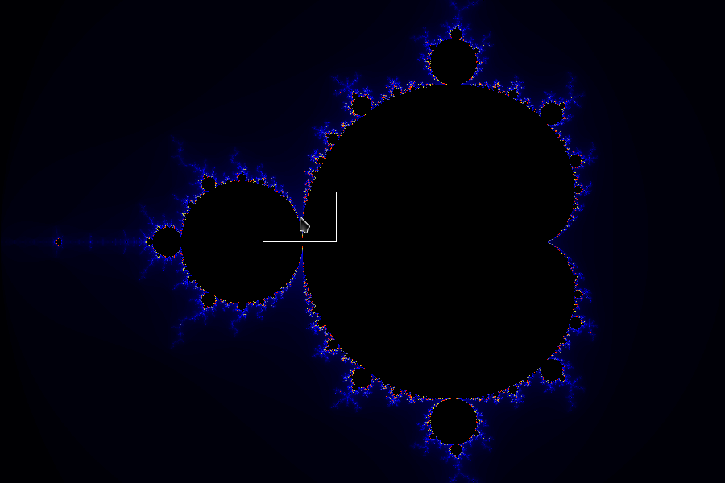

#Mandelbrot

Mandelbrot fractal generator and viewer. Uses the SFML ([sfml-dev.org](sfml-dev.org)) and rust-sfml ([rust-sfml.org](rust-sfml.org)) to generate and display the image.

##Installation

Works on Linux 64bits (only tested on Debian Jessie - amd64), but it should work on most OS.

###Prerequisites

Make sure you've installed SFML and CSFML 2.0 (available on [sfml-dev.org](sfml-dev.org)).
You should also install the latest rustc and Cargo version ([rust-sfml.org](rust-sfml.org)).
Then install the rust-sfml crate (you can download it from Github, as it isn't available on [crates.io](crates.io) for the moment).

###Download and install

1. Download the git package (either with `git clone` or in zip format).
2. Extract here (if it's a zip) and go in the directory (the one called _rust-mandelbrot_).
3. Type `cargo build` to build it, and `cargo build --release` to have some optimizations.
4. Launch it with `cargo run`.

##Use

You can use rust-mandelbrot with two commands :

###generate

The `generate` command create a Mandelbrot Set into an image file, using the Image SFML object. The command takes 4 arguments : the panel of the Set you want to render, the image dimensions, the max iterations to compute the Set's points and the path of the image file.

    $ rust-mandelbrot generate -1,-2,3,2 900,600 100 mandelbrot.png

Notice that default settings are built-in :

    $ rust-mandelbrot generate ? ? 100 mandelbrot.png

###draw

The `draw` command launch the interactive Set Viewer. It starts with a specific frame of the Mandelbrot Set (which you precise in the command arguments), and then you can zoom-in with the mouse (left-click). You can also go back to the original view with the right-click.
Like the `generate` command, the `draw` command takes a few arguments : the frame of the original view, the image dimensions and the max iterations :

    $ rust-mandelbrot draw -1,-2,3,2 900,600 100

Like the generate command, default arguments exist :

    $ rust-mandelbrot draw ? ? 100

##TODO

*Optimizations on the draw / generate algorithm
*Use colors to make the set more beautiful :)
*Authorize to change the window's size
*Make a 'zoom out' feature
